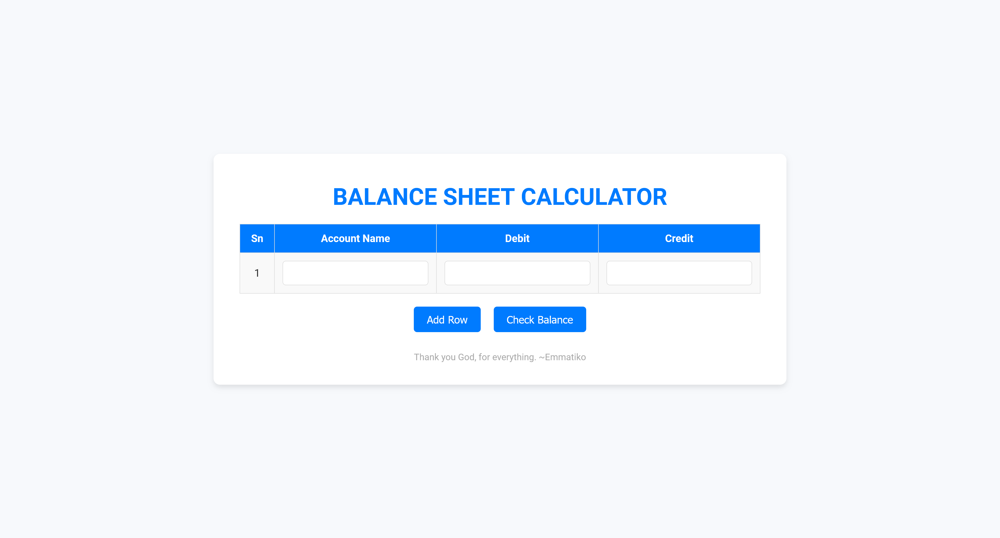

# Balance Sheet Calculator 
**A sleek and intuitive web application designed to calculate balance sheets with ease.**


---

## 🌟 Features  

- **Dynamic Row Addition**: Add new rows dynamically to input account names, debit, and credit values.  
- **Real-Time Balance Checking**: Easily verify if your balance sheet is balanced with the click of a button.  
- **Responsive Design**: Optimized for seamless use across various devices.  
- **Beautiful UI**: Designed with a modern, clean, and professional aesthetic.  

---

## 🖥️ Project Structure  

This project is composed of three primary files:  

1. **HTML**: The core structure of the app, located in `bs.html`.  
2. **CSS**: Stylish and user-friendly designs, located in `bs.css`.  
3. **JavaScript**: Interactive functionality, located in `bs.js`.  

---

## 🚀 How to Run Locally  

1. Clone this repository:  
   ```bash  
   git clone https://github.com/emma7iko/balance-sheet-calculator.git  
   ```  
2. Navigate to the project directory:  
   ```bash  
   cd balance-sheet-calculator  
   ```  
3. Open the `bs.html` file in your browser to start using the application.  

---

## 📂 Folder Structure  

```  
balance-sheet-calculator/  
├── bs.html   # Main HTML file  
├── bs.css    # Stylesheet  
├── bs.js     # JavaScript for functionality  
└── icon.jpeg # Favicon for branding  
```  


## ✨ How It Works  

1. **Input Data**: Enter account names, debit, and credit values into the table.  
2. **Add Rows**: Add as many rows as needed to accommodate your data.  
3. **Check Balance**: Click the "Check Balance" button to verify if the sheet is balanced.  

---

## 🛠️ Built With  

| **Technology**      | **Logo**                                  |  
|----------------------|-------------------------------------------|  
| HTML5               |  |  
| CSS3                |  |  
| JavaScript (ES6+)   |  |  
| Google Fonts        |  |  

---
